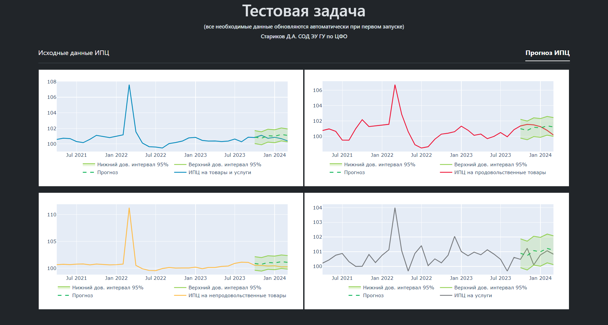
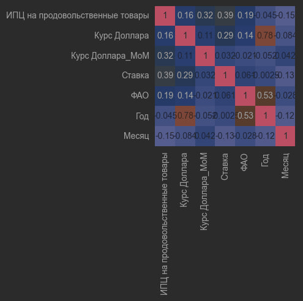
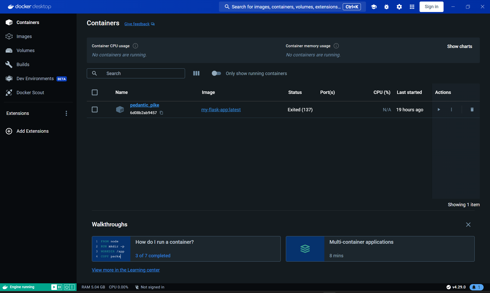

# Тестовое задание для ДДПП
Программное решение, которое:
* Автоматически загружает данные по индексам потребительских цен (ИПЦ) с официального [сайта Росстата](https://rosstat.gov.ru/statistics/price#),
* Визуализирует полученные данные,
* Использует 4 модели машинного обучения (МО) для прогноза на 6 месяцев и визуализирует результаты в виде интерактивных графиков на веб-сайте.

Весь код упакован в Docker-контейнер и размещен на GitHub.
<!-- описание репозитория -->

<!--Блок информации о репозитории в бейджах-->

<!--Установка-->
## Установка
У вас должны быть установлены [зависимости проекта](https://github.com/das1204/A-test-assignment-for-the-DPPD#зависимости)

1. Клонирование репозитория 

```git clone https://github.com/das1204/A-test-assignment-for-the-DPPD.git```

2. Переход в директорию Oxygen

```cd A-test-assignment-for-the-DPPD```

3. Установка зависимостей

```pip3 install -r requirements.txt```

4. Запуск скрипта для демонстрации работы

```python3 app.py```


<!--зависимости-->
## Зависимости
Эта программа зависит от интепретатора Python версии 3.9 или выше.

<!--Логика работы-->
## Алгоритм

### Главная страница

При запуске скрипта ```app.py``` автоматически открывается главная страница проекта (```/```).

P.S. Первый запуск при каждом новом открытии сайта занимает какое-то время, поскольку автоматически подгружаются данные ИПЦ с Росстата, а также [Ключевая ставка](https://cbr.ru/hd_base/KeyRate/?UniDbQuery.Posted=True) и [Курс Доллара США](https://cbr.ru/currency_base/dynamics/?UniDbQuery.Posted=True&UniDbQuery.so=0&UniDbQuery.mode=1&UniDbQuery.date_req1=&UniDbQuery.date_req2=&UniDbQuery.VAL_NM_RQ=R01235) с сайта Банка России.


Основным элементом главной страницы сайта является интегрированный интерактивный график, созданный с помощью библиотеки ```Plotly```.
На график выводятся все четыря ряда ИПЦ за период с 01.01.2000 по н.в.:
*  ИПЦ на товары и услуги 
*  ИПЦ на продовольственные товары 
*  ИПЦ на непродовольственные товары 
*  ИПЦ на услуги

Кроме того, на график добавлены 5 кнопок для выбора отображаемого временного периода (1, 2, 5, 10 и 20 лет), а также селектор, позволяющий выбирать произвольный отображаемый диапазон.

Подписи рядов также являются интерактивными: нажатие на название ряда скрывает/отображает его на графике.

### Страница с прогнозом

При первом переходе на страницу "Прогноз ИПЦ" (```/forecast```) автоматически подгружаются 4 модели МО, обученные специально для каждого из рядов и строится  прогноз на 6 точек.

Для каждого из рядов прогноза строится  верхний и нижний доверительный интервал на уровне 95%.

Формула для нахождения значений верхней и нижней границ:

$$y_{ui} = \hat{y}_i + 1.96 \times RMSE $$

$$y_{li} = \hat{y}_i - 1.96 \times RMSE $$



Все графики, как и график на главной странице являются интерактивными.

### Выбор модели МО

Для каждого из рядов ИПЦ подбиралась уникальная модель МО из списка:
<!-- * ```SARIMA``` из библиотеки ```statsmodels```, параметры подобраны с помощью ```GridSearchCV```, -->
* ```LogisticRegression``` из библиотеки ```scikit-learn```, использовались параметры по умолчанию,
* ```RandomForestClassifie``` из библиотеки ```scikit-learn```, использовались параметры по умолчанию,
* ```XGBRegressor``` из библиотеки ```xgboost```, использовались параметры по умолчанию,
* ```XGBRegressor``` из библиотеки ```xgboost```, параметры подобраны с помощью ```GridSearchCV```.

Для каждого ряда в качестве вспомогательных рядов используются:
* Ряд "Курс доллара США, MoM", дающий корреляцию на отрезке с 09.2013 более 49%,

$$x_{$i} = \frac{x_{$i}}{x_{$i-1}} $$

* Ряд "Ключевая ставка ЦБ (среднемесячные значения)", дающий корреляцию на отрезке с 09.2013 более 38%.

Ряды "Год", "Месяц", "Курс доллара США", а также ряд "[Индекс ФАО](https://www.fao.org/worldfoodsituation/foodpricesindex/ru)" (для ряда "ИПЦ на продовольственные товары") не использовались из-за низкого значения корреляции.



Для каждой модели рассчитывались метрики:
* ```MSE``` - среднеквадратичная разницу между прогнозируемыми значениями и фактическими значениями. Чем ниже ```MSE```, тем лучше модель.
$$MSE = \frac{1}{n} \sum_{i=1} ^{n} (\hat{y}_i - y_i)^2 $$
* ```MAPE``` - среднее абсолютное значение процентного отклонения между прогнозируемыми значениями и их фактическими значениями. Чем ниже ```MAPE```, тем лучше модель.
$$MAPE = \frac{1}{n} \sum_{i=1}^{n} \left| \frac{y_i - \hat{y}_i}{y_i} \right| \times 100 \\% $$
* Коэффициент детерминации ```R^2``` - мера, которая объясняет, насколько модель соответствует данным. Он представляет собой долю дисперсии зависимой переменной, которая может быть объяснена независимыми переменными в модели. ```R^2``` принимает значения от 0 до 1. Чем ближе значение ```R^2``` к 1, тем лучше модель соответствует данным. Если ```R^2``` равно 0, это означает, что модель не объясняет никакой дисперсии данных.
$$R^2 = 1 - \frac{\sum_{i=1}^{n} (y_i - \hat{y}_i)^{2}} {\sum_{i=1}^{n} (y_i - \bar{y})^{2}} $$

### Результаты

Интересным итогом разработки моделей МО стало то, что для всех рядов на тестовой выборке лучшую метрику ```MAPE``` всегда показывала самая "простая" модель - ```LogisticRegression``` (по ```MSE``` это были ```RandomForestClassifie``` и ```XGBRegressor```), однако на валидационной выборке (6 последних точек) во всех случаях по всем метрикам лучшее качество прогноза показывала модель ```LogisticRegression```, которая и была выбрана для интеграции в сайт.

## ИТОГ
* Исходный код проекта размещен на GitHub в открытом доступе вместе с Dockerfile.
* Создан Docker-image и контейнер Docker.

<!---->


