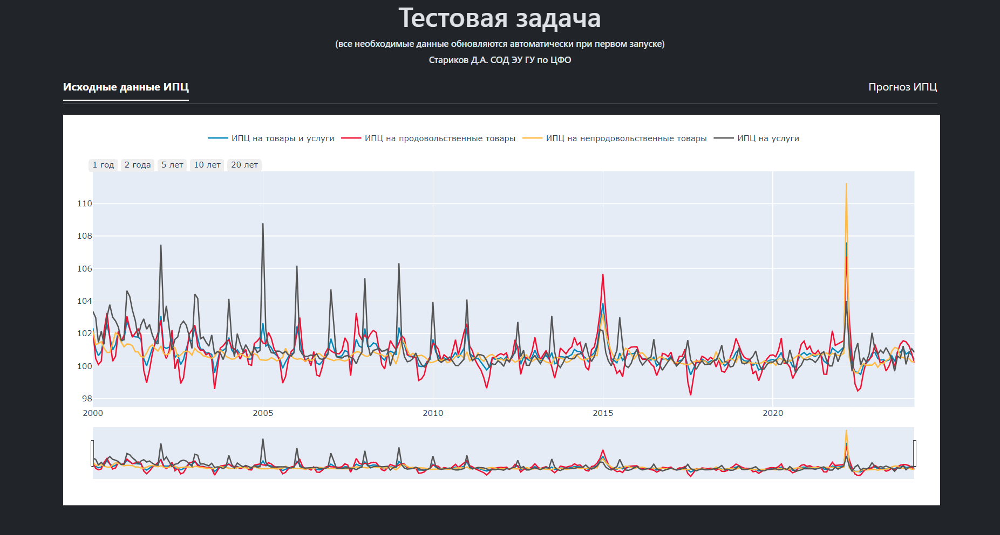

# Тестовое задание для ДДПП
Программное решение, которое:
* Автоматически загружает данные по индексам потребительских цен (ИПЦ) с официального [сайта Росстата](https://rosstat.gov.ru/statistics/price#),
* Визуализирует полученные данные,
* Использует 4 модели МО для прогноза на 6 месяцев и визуализирует результаты в виде интерактивных графиков на веб-сайте.

Весь код упакован в Docker-контейнер и размещен на GitHub.
<!-- описание репозитория -->

<!--Блок информации о репозитории в бейджах-->

<!--Установка-->
## Установка
У вас должны быть установлены [зависимости проекта](https://github.com/das1204/A-test-assignment-for-the-DPPD#зависимости)

1. Клонирование репозитория 

```git clone https://github.com/das1204/A-test-assignment-for-the-DPPD.git```

2. Переход в директорию Oxygen

```cd A-test-assignment-for-the-DPPD```

3. Установка зависимостей

```pip3 install -r requirements.txt```

4. Запуск скрипта для демонстрации работы

```python3 app.py```


<!--зависимости-->
## Зависимости
Эта программа зависит от интепретатора Python версии 3.9 или выше.

<!--Логика работы-->
## Алгоритм 

При запуске скрипта ```app.py``` автоматически открывается главная страница проекта.
P.S. Первый запуск при каждом новом открытии сайта занимает какое-то время, поскольку автоматически подгружаются данные ИПЦ с Росстата, а также [Ключевая ставка](https://cbr.ru/hd_base/KeyRate/?UniDbQuery.Posted=True) и [Курс Доллара США](https://cbr.ru/currency_base/dynamics/?UniDbQuery.Posted=True&UniDbQuery.so=0&UniDbQuery.mode=1&UniDbQuery.date_req1=&UniDbQuery.date_req2=&UniDbQuery.VAL_NM_RQ=R01235) с сайта Банка России.



Основным элементом главной страницы сайта является интегрированный html-график созданный с помощью библиотеки ```Plotly```. На график выводяться все четыря ряда ИПЦ:
*  ИПЦ на товары и услуги 
*  ИПЦ на продовольственные товары 
*  ИПЦ на непродовольственные товары 
*  ИПЦ на услуги 

